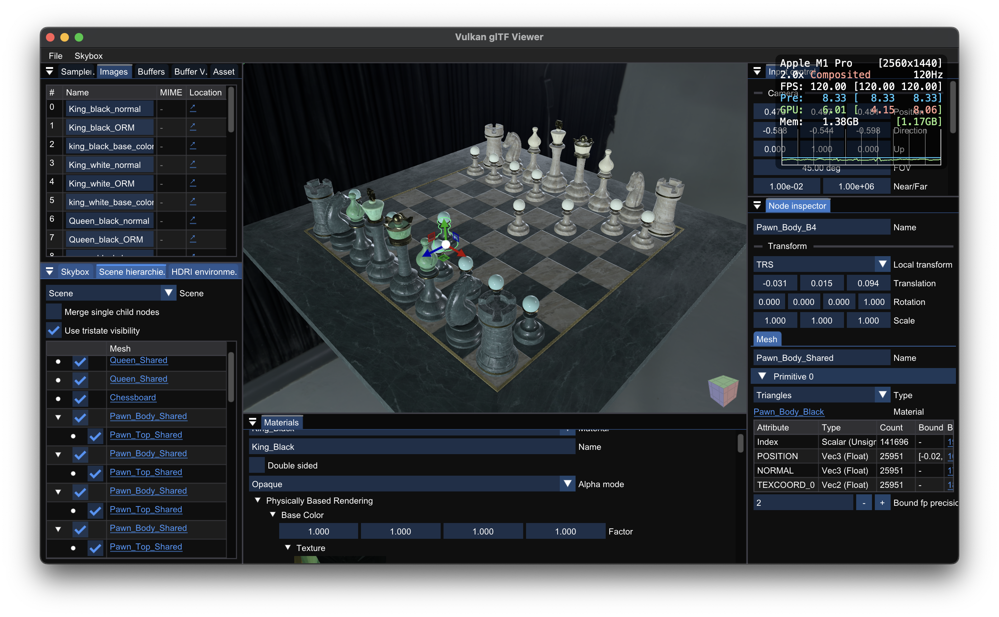
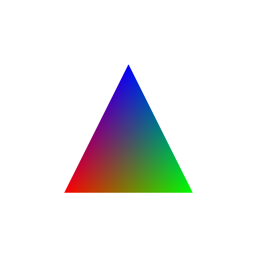
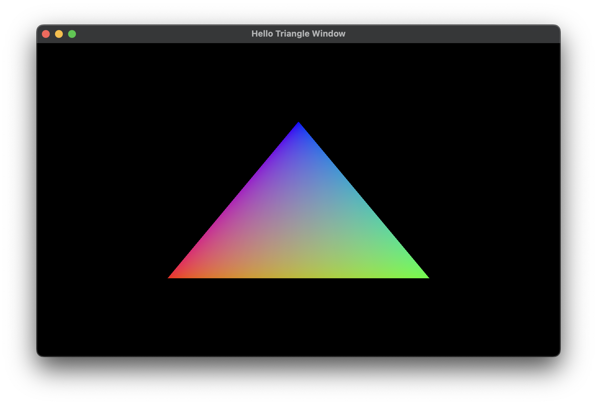
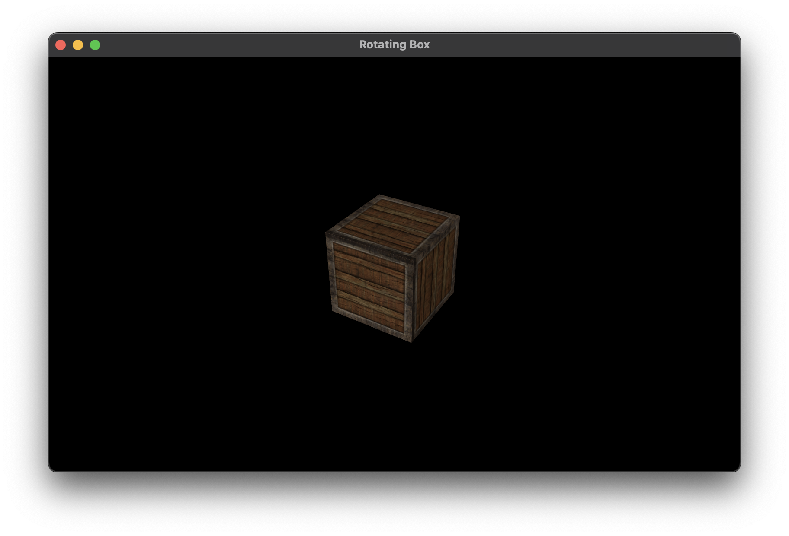

# vku

A set of Vulkan utilities based on RAII idiom and Modern C++ features.

## Features

- Based on C++20 module and (optionally) C++23 standard library module: just single line `import vku;` will cover all. **Module support is mandatory! (No header file provided.)**
- Can be easily integrated to your existing project by vcpkg.
- RAII handle for buffer and image with Vulkan Memory Allocator (VMA), with rich set of information.
- Bootstrapping for physical device, device and VMA allocator generation with fully customizable configurations and compile time safety.
  - Automatic physical device selection based on queue family and extension requirements.
  - Show accepted/rejected physical devices with your requirements.
- Templated descriptor set layout, automatic descriptor write inferring and pool size estimation.
- Managing multiple attachment image and views with MSAA and `VK_KHR_dynamic_rendering` support.
- Combining runtime shader compilation, shader loading and pipeline creation to single function.
- Executing hierarchical commands across the multiple queues with most efficient way using `VK_KHR_timeline_semaphore`, by runtime dependency graph solver.
- Forwarding your Vulkan code logics by "inlining" the structure initialization.
- Useful utility functions including debugging support.
- And more...

## Projects that uses vku

I wrote several Vulkan projects using *vku*.

|                                                                                                        Project                                                                                                        |                                                                                                                                                                                                                                                                                                                                                                                                                                                                                                                                                                                                              Description                                                                                                                                                                                                                                                                                                                                                                                                                                                                                                                                                                                                               |
|:---------------------------------------------------------------------------------------------------------------------------------------------------------------------------------------------------------------------:|:--------------------------------------------------------------------------------------------------------------------------------------------------------------------------------------------------------------------------------------------------------------------------------------------------------------------------------------------------------------------------------------------------------------------------------------------------------------------------------------------------------------------------------------------------------------------------------------------------------------------------------------------------------------------------------------------------------------------------------------------------------------------------------------------------------------------------------------------------------------------------------------------------------------------------------------------------------------------------------------------------------------------------------------------------------------------------------------------------------------------------------------------------------------------------------------------------------------------------------------:|
|                          [Vulkan glTF Viewer](https://github.com/stripe2933/vk-gltf-viewer) (Currently no README)                         | Blazingly fast Vulkan glTF viewer. Fully bindless, GPU driven, async compute/transfer support. 

Detailed features
<ul><li>Fully bindless (descriptor set only updated in the model loading time), vertex pulling based, and GPU driven indirect rendering. **All scene nodes can be rendered with up to 8 draw calls** regardless of their material properties and complexity.</li><li>PBR (physical based rendering) + IBL (image based lighting), support **asynchronous runtime spherical harmonics and prefiltered map generation using only compute shader**.</li><li>Can render opaque, alpha tested (using Alpha to Coverage) and translucent (using Weighted Blended OIT) materials.</li><li>**Directly memcpy the glTF buffer memory into GPU using multi-thread, dedicated transfer queue without pre-processing**, makes faster resource loading time.</li><li>Unlimited texture coordinate indices count (can render a primitive that has arbitrary `TEXCOORD_<i>`) using buffer device address approach.</li><li>Pixel-perfect mouse picking, outline rendering and transformation gizmo for scene nodes.</li><li>Can mainpulate the node visibility based on hierarchy.</li></ul>
 |
|                  [vk-deferred](https://github.com/stripe2933/vk-deferred)                 |                                                                                                                                                                                                                                                                                                                                                                                                                                                                                                                                                                                 Application that demonstrates the deferred rendering with 1500 lights.                                                                                                                                                                                                                                                                                                                                                                                                                                                                                                                                                                                 |
|  [vk-weighted-blended](https://github.com/stripe2933/vk-weighted-blended) |                                                                                                                                                                                                                                                                                                                                                                                                                                                                                                                                                                              Rendering 25 opaque and 100 translucent objects using Weighted Blended OIT.                                                                                                                                                                                                                                                                                                                                                                                                                                                                                                                                                                               |

## Getting Started

### Build Steps

*vku* can be used with CMake `find_package`, `FetchContent`, `CPM.cmake` or vcpkg (using overlay ports). See [Using vku](docs/using-vku.md) for details.

> [!NOTE]
> *vku* can only be used with overlay ports when using vcpkg for now. I'm currently planning for make *vku* to be available with vcpkg official ports.

### Tutorials

For library users' best understanding, I wrote step-by-step tutorials for building some Vulkan applications using *vku*. For each step, it first shows how Vulkan-Hpp (with RAII binding) does, then which portion of the code can be simplified with *vku*. I really recommend you to read them.

|                                             Tutorial                                              | Description                                                                                                                                                                                                                                                                                                                                                                                                                                                                                                         |
|:-------------------------------------------------------------------------------------------------:|---------------------------------------------------------------------------------------------------------------------------------------------------------------------------------------------------------------------------------------------------------------------------------------------------------------------------------------------------------------------------------------------------------------------------------------------------------------------------------------------------------------------|
|   [Hello Triangle](docs/hello-triangle.md)  | It demonstrates the most simplest Vulkan application with graphics operation, rendering a colored triangle onto image, and additionally persist the image into the file.  You'll learn:  <ul><li>Boostrapping physical device, device and VMA allocator creation with `vku::Gpu<QueueFamilies, Queues>`.</li><li>Creating RAII buffer (`vku::MappedBuffer`) and image (`vku::AllocatedImage`).</li><li>Creating graphics pipeline with *vku* way.</li><li>Executing a single command with *vku*.</li></ul> |
|  Hello Triangle Window (In Progress) | It renders the triangle in a resizable GLFW window.  You'll learn: <ul><li>Customizing `vku::Gpu` queue family selection configuration.</li><li>Use `vku::AttachmentGroup` to manage multiple swapchain images into single object.</li><li>Structuring your Vulkan project into separated single-responsibility classes.</li><li>Implementing Frames in flight.</li></ul>                                                                                                                                     |
|           Rotating Box (In Progress)          | It renders a textured rotating box with 4x MSAA.  You'll learn: <ul><li>Use `vku::MsaaAttachmentGroup` to manage the whole color/depth/swapchain images at once.</li><li>Creating typed descriptor set layout with `vku::DescriptorSet`.</li><li>Estimating the required descriptor pool size from descriptor sets automatically by `vku::PoolSize`.</li><li>Infer the required descriptor writes using `vku::DescriptorSet<DescriptorSetLayout>`.</li></ul>                                                  |

### Tests

It uses GitHub Runner to test the build availability with Clang (Linux) or MSVC (Windows). See [workflow files](.github/workflows) for details.

Also, some parts of codes have [the test codes](test) to validate their intended behaviors. You can set `VKU_ENABLE_TEST` CMake variable as `ON` in configuration time to enable the test build.

## License

This project is licensed under the MIT License - see the [LICENSE](LICENSE.txt) file for details.