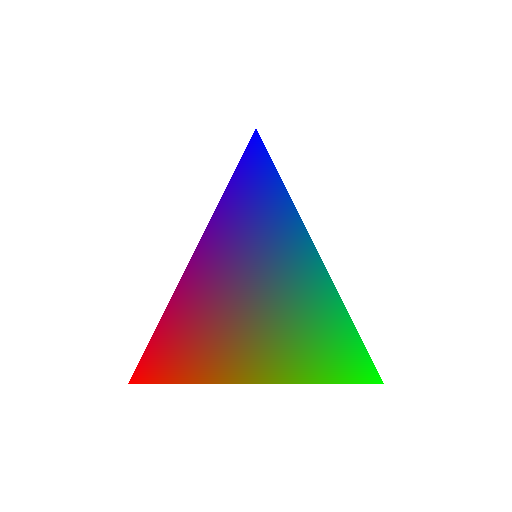

# Tutorial: Hello Triangle

In this tutorial, we'll create the simple triangle renderer without WSI.



> [!WARNING]
> For simpler setup, we'll use `VK_KHR_dynamic_rendering` device extension to ditch the complex render pass and framebuffer setup, therefore make sure your system supports the extension.

I'll explain each steps using Vulkan-Hpp RAII bindings for first, and then will explain which portion of the code can be replaced with *vku* style. Note that this example has no WSI support yet, which will be covered in the next tutorial.

Here's the base code for the tutorial:

`CMakeLists.txt`
```cmake
cmake_minimum_required(VERSION 3.30)

# Set experimental flag to enable `import std` support from CMake.
set(CMAKE_EXPERIMENTAL_CXX_IMPORT_STD "0e5b6991-d74f-4b3d-a41c-cf096e0b2508")

project(vku-tutorial LANGUAGES CXX)

set(CMAKE_CXX_STANDARD 23)
set(CMAKE_CXX_MODULE_STD 1)

# ----------------
# External dependencies.
# ----------------

find_package(vku CONFIG REQUIRED)

# ----------------
# Project executables.
# ----------------

add_executable(vku-tutorial main.cpp)
target_link_libraries(vku-tutorial PRIVATE vku::vku)
```

`main.cpp`
```c++
import std;
import vku;

int main() {
    // Code starts from here...
}
```

`vcpkg.json` (can be created by running `vcpkg new --application` in the project directory)
```json
{
  "dependencies": [
    "vku"
  ]
}
```

## 1. Creating Vulkan Instance

To use the Vulkan API, an instance have to be created. Also, for Vulkan-Hpp's RAII binding, `vk::raii::Context` have to be created before the instance creation (which is not a part of the [Vulkan specification](https://registry.khronos.org/vulkan/specs/1.3-extensions/html/vkspec.html)). We'll use Vulkan 1.0 to start from the scratch.

```c++
int main() {
    const vk::raii::Context context;
    
    constexpr vk::ApplicationInfo appInfo {
        "Hello Triangle", // pApplicationName 
        0, // applicationVersion
        nullptr, // pEngineName 
        0, // engineVersion
        vk::makeApiVersion(0, 1, 0, 0),
    };
    const vk::raii::Instance instance { context, vk::InstanceCreateInfo {
        {}, // flags
        &appInfo,
    } };
}
```

We created a Vulkan instance with application name `Hello Triangle`. I won't explain the further detail for Vulkan structure field's meaning, as it's already explained in the Vulkan specification. If you're not familiar with these, I suggest you to use raw Vulkan API first (this library assumes you're already familiar with Vulkan API).

### `ErrorIncompatibleDriver` error on MoltenVK

If you're on macOS and running Vulkan with [MoltenVK](https://github.com/KhronosGroup/MoltenVK) environment, you will likely get an error like this:

> libc++abi: terminating due to uncaught exception of type vk::IncompatibleDriverError: Context::createInstance: ErrorIncompatibleDriver
>
> Process finished with exit code 134 (interrupted by signal 6:SIGABRT)

Since MoltenVK is portable implementation of Vulkan based on Apple's Metal API, you have to specify the proper fields for the extension, `VK_KHR_portability_subset`. Here's the modified code:

```c++
int main() {
    const vk::raii::Context context;

    constexpr vk::ApplicationInfo appInfo {
        "Hello Triangle", 0,
        nullptr, 0,
        vk::makeApiVersion(0, 1, 0, 0),
    };
#if __APPLE__
    constexpr std::array instanceExtensions {
        vk::KHRGetPhysicalDeviceProperties2ExtensionName,
        vk::KHRPortabilityEnumerationExtensionName,
    };
#endif
    const vk::raii::Instance instance { context, vk::InstanceCreateInfo {
#if __APPLE__
        vk::InstanceCreateFlagBits::eEnumeratePortabilityKHR, // flags
#else
        {},
#endif
        &appInfo,
        {}, // pEnabledLayerNames
#if __APPLE__
        instanceExtensions, // pEnabledExtensionNames
#endif
    } };
}
```

> [!TIP]
> I intentionally didn't add the instance layer `VK_LAYER_KHRONOS_validation`, because most of the tutorial reader are likely use the Vulkan with LunarG provided Vulkan SDK, and the validation layer can be configured via [Vulkan Configurator](https://www.lunarg.com/introducing-the-new-vulkan-configurator-vkconfig/). Also, I won't use the debug utils messenger for the same reason. I recommend you to turn on the validation layer. 

Now running your application will successfully create a Vulkan instance and returning 0.

---

Let's talk about the current code's refactoring point. You may notice that you cannot "inline" the parameters into `vk::InstanceCreateInfo` directly, such like

```c++
const vk::raii::Instance { context, vk::InstanceCreateInfo {
    {},
    &vk::ApplicationInfo { ... }, // <- Can't take the address of a rvalue.
    {},
    { ... }, // <- vk::ArrayProxyNoTemporaries doesn't allow the construction from a rvalue.
} };
```

The reason why Vulkan-Hpp disallows the construction of `vk::ArrayProxyNoTemporaries` from a rvalue is: the referenced data must be alive until the referencing struct is used in a Vulkan function. The following malformed code shows why it's dangerous:

```c++
const vk::InstanceCreateInfo ci { 
    ...,
    { extension1, extension2, ... },
}; // std::initializer_list of the extensions is destroyed at here.
const vk::raii::Instance instance { context, ci }; // ci refers the dangling.
```

However, let's back to the first code. Since the temporary objects are destroyed at the end of an expression, `vk::ApplicationInfo` struct and instance extensions `initializer_list` will not be destroyed until its effective usage.

For such convenience, *vku* provides the two functions, `vku::unsafeAddress(const T&)` and `vku::unsafeProxy(const <contiguous-range>&)`.

- `unsafeAddress` accepts a const-qualified value and return its address. The returned value is valid until the expression end.
- `unsafeProxy` accepts a const-qualified lvalue of a contiguous range (`std::array`, `std::vector`, `std::initializer_list`, ...) or a value and return `vk::ArrayProxyNoTemporaries` that can be used in Vulkan-Hpp. The returned proxy object is valid until the expression end.

With these functions, you can write the code like this:

```c++
const vk::raii::Context context;

const vk::raii::Instance instance { context, vk::InstanceCreateInfo {
#if __APPLE__
    vk::InstanceCreateFlagBits::eEnumeratePortabilityKHR,
#else
    {},
#endif
    vku::unsafeAddress(vk::ApplicationInfo {
        "Hello Triangle", 0,
        nullptr, 0,
        vk::makeApiVersion(0, 1, 0, 0),
    }),
    {},
#if __APPLE__
    vku::unsafeProxy({
        vk::KHRGetPhysicalDeviceProperties2ExtensionName,
        vk::KHRPortabilityEnumerationExtensionName,
    }),
#endif
} };
```

Which got cleaner, and you don't have to name some trivial structs.

### Safeness of `vku::unsafeAddress` and `vku::unsafeProxy`

You have responsibility for object lifetime management, that's the reason why they are prefixed with `unsafe`.

However, if you're Clang or MSVC user, you can get a warning for some misusage, due to the graceful compiler attribute `[[lifetimebound]]` ([Clang](https://clang.llvm.org/docs/AttributeReference.html#id593), [MSVC](https://learn.microsoft.com/en-us/cpp/code-quality/c26816?view=msvc-170)). Their function parameters are marked with the attribute, and you'll get warning when the lifetime of the parameter is shorter than the function's return value.

## 2. Creating a Vulkan Device with a Graphics Capable Queue

For this step, we'll get a physical device from `instance`, and create a device with graphics queue. First, we have to check if there is a graphics operation cable physical device.

```c++
int main() {
    ... 
    const vk::raii::Instance instance { ... };
    
    std::uint32_t graphicsQueueFamilyIndex;
    const vk::raii::PhysicalDevice physicalDevice = [&] {
        for (const vk::raii::PhysicalDevice &physicalDevice : instance.enumeratePhysicalDevices()) {
            for (std::uint32_t queueFamilyIndex = 0; vk::QueueFamilyProperties properties : physicalDevice.getQueueFamilyProperties()) {
                if (properties.queueFlags & vk::QueueFlagBits::eGraphics) {
                    graphicsQueueFamilyIndex = queueFamilyIndex;
                    return physicalDevice;
                }

                ++queueFamilyIndex;
            }
        }

        throw std::runtime_error { "No graphics operation supporting GPU." };
    }();
}
```

For this tutorial, we only queried about the graphics queue family support for simplicity, but this process is widely varying on the Vulkan API usage, such as:

- Need dedicated compute/transfer queue.
- Need to check the surface support for WSI.
- Need to check some GPU specific feature support.
- Selecting the "best" GPU with the above requirements.

I'll cover how these can be managed by *vku* later.

Next, creating a device with the graphics queue:

```c++
int main() {
    ...
    const vk::raii::PhysicalDevice physicalDevice { ... };

    const vk::raii::Device device { physicalDevice, vk::DeviceCreateInfo {
        {}, // flags
        vku::unsafeProxy({ // queueCreateInfos
            vk::DeviceQueueCreateInfo { 
                {}, // flags 
                graphicsQueueFamilyIndex, 
                vku::unsafeProxy({ 1.f }), // queuePriorities
            },
        }),
        {}, // pEnabledLayerNames
#if __APPLE__
        vku::unsafeProxy({
            vk::KHRPortabilitySubsetExtensionName,
        }), // pEnabledExtensionNames
#endif
    } };
    const vk::Queue graphicsQueue = (*device).getQueue(graphicsQueueFamilyIndex, /* queueIndex */ 0);
}
```

We created graphics capable queue with priority 1.0 (full priority).

---

Wow, we've done a lot of things! The amount of code is not much unbearable, but it's quite verbose and troublesome. Let's see how *vku* can help you with this.

*vku* provides the following `Gpu<QueueFamilies, Queues>` class for more convenient and structured physical device selection and device creation. Here's the same featuring code with *vku*:

```c++
struct QueueFamilies {
    std::uint32_t graphics;

    explicit QueueFamilies(vk::PhysicalDevice physicalDevice)
        : graphics { vku::getGraphicsQueueFamily(physicalDevice.getQueueFamilyProperties()).value() } { }
};

struct Queues {
    vk::Queue graphics;

    Queues(vk::Device device, const QueueFamilies &queueFamilies)
        : graphics { device.getQueue(queueFamilies.graphics, 0) } { }

    [[nodiscard]] static auto getCreateInfos(vk::PhysicalDevice, const QueueFamilies &queueFamilies) noexcept {
        return vku::RefHolder {
            [=](std::span<const float> priorities) {
                return std::array {
                    vk::DeviceQueueCreateInfo {
                        {},
                        queueFamilies.graphics,
                        priorities,
                    },
                };
            },
            std::array { 1.f },
        };
    }
};

struct Gpu : vku::Gpu<QueueFamilies, Queues> {
    explicit Gpu(const vk::raii::Instance &instance)
        : vku::Gpu<QueueFamilies, Queues> { instance, vku::Gpu<QueueFamilies, Queues>::Config {
#if __APPLE__
            .deviceExtensions = {
                vk::KHRPortabilitySubsetExtensionName,
            },
#endif
        } } { }
};

int main() {
    ...
    const vk::raii::Instance instance { ... };
    
    const Gpu gpu { instance };
    // gpu.physicalDevice (vk::raii::PhysicalDevice)
    // gpu.queueFamilies (QueueFamilies)
    // gpu.device (vk::raii::Device)
    // gpu.queues (Queues)
    // gpu.allocator (vma::Allocator)
}
```

`vku::Gpu::Config` has many parameters for sophisticated, fine-grained physical device selection, but I'll leave that details for later.

Here's the explanation of the code:

1. The process is done in same order of our Vulkan-Hpp based code. It enumerates the physical devices and "check" some availability of them, with following criteria:

   - Having the required queue families: for each physical device, *vku* tried to construct the given `QueueFamilies` struct with it. If error thrown, it skipped for candidates.
   - Having the required device extensions: *vku* enumerates the available device extensions and check if the required extensions are supported. If not, it skipped for candidates.
   - Having the required physical device features: will be explained in later.
   - For remaining physical devices candidates, *vku* rates them by their properties, which has the same rule of [vulkan-tutorial](https://vulkan-tutorial.com/Drawing_a_triangle/Setup/Physical_devices_and_queue_families#page_Base-device-suitability-checks)'s. The best scored physical device is selected.

2. After physical device selection, `QueueFamilies` struct is constructed with the selected physical device. `vku::getGraphicsQueueFamily` is a helper function that accepts a physical device's queue family properties and returns the queue family index that supports the graphics operation.

3. After that, device is created with `Config`'s device extensions and queue create infos provided by `Queues::getCreateInfos`. This function have to be implemented by user with following constraint:

   - It's signature must be `static auto getCreateInfos(vk::PhysicalDevice, const QueueFamilies&)`. It determines the required `vk::DeviceQueueCreateInfo`s for the device creation.
   - It must return `vku::RefHolder` of contiguous `vk::DeviceQueueCreateInfo` container. `vku::RefHolder<T, Args...>` is a util class, a container that can be contextually converted to a reference of type `T`, which has references for objects of `Args...`. In this code, since the returning `std::array<vk::DeviceQueueCreateInfo, 1>` needs the reference of queue priority array, it's wrapped with `vku::RefHolder`.

4. After device creation, the queues are created by constructing `Queues` with the device and queue families. This is implemented by user side.

5. Finally, it creates `vma::Allocator`, which is the main allocator of *vku*. Would be explained in later.

> [!INFO]
> Note that the returning container type of `Queues::getCreateInfos` doesn't have to be exactly `std::array`. `vku::Gpu` checks only if it's a contiguous range, therefore you can use `std::vector` or your own container type.

> [!TIP]
> You can use your own constructor for `QueueFamilies` and `Queues` structs. In further tutorials, I'll show you how to use the `vku::Gpu::Config` for more sophisticated physical device selection. The only requirement of these structs is that `QueueFamilies` must have `static auto getCreateInfos(vk::PhysicalDevice, const QueueFamilies&)` function.

If you want the detailed physical device selection, you can simply pass the `verbose` boolean field as `true` to the `Gpu` constructor. With flag, it will print the list of the rejected physical devices with reasons, and will print the selected physical device with its score.

<details>
   <summary>Example</summary>
   For example, the following (more sophisticated GPU selection) code
   
   ```c++
   struct Gpu : vku::Gpu<QueueFamilies, Queues> {
       explicit Gpu(const vk::raii::Instance &instance)
           : vku::Gpu<QueueFamilies, Queues> { instance, vku::Gpu<QueueFamilies, Queues>::Config {
               .verbose = true,
               .deviceExtensions = {
   #if __APPLE__
                   vk::KHRPortabilitySubsetExtensionName,
   #endif
                   vk::KHRMaintenance4ExtensionName,
                   vk::EXTDescriptorBufferExtensionName,
                   vk::KHRDynamicRenderingLocalReadExtensionName,
               },
               .physicalDeviceFeatures = vk::PhysicalDeviceFeatures{}
                   .setGeometryShader(true)
                   .setIndependentBlend(true),
               .devicePNexts = std::tuple {
                   vk::PhysicalDeviceDescriptorBufferFeaturesEXT{}
                       .setDescriptorBuffer(true)
                       .setDescriptorBufferCaptureReplay(true),
                   vk::PhysicalDeviceDynamicRenderingLocalReadFeaturesKHR{}
                       .setDynamicRenderingLocalRead(true),
               },
               .apiVersion = vk::makeApiVersion(0, 1, 3, 0),
           } } { }
   };
   ```
   
   The possible output is:
   
   > Physical device "Intel UHD Graphics 4000" rejected because it lacks the following device extensions: [VK_KHR_dynamic_rendering_local_read, VK_KHR_maintenance4]
   > 
   > Physical device "NVIDIA MX 150" rejected because it lacks the following physical device features: [geometryShader]
   > 
   > Physical device "NVIDIA RTX 2080" accepted (score=16384).
</details>


Like many other *vku* objects, `vku::Gpu` follows the RAII convention, and it automatically destroys the created device and allocator when it is destroyed.

## 3. Creating the Image to Be Rendered

Now, we have to create the 512x512 image that are used for rendering attachment. For this step, I'll just briefly explain how the conventional Vulkan-Hpp code does, because it is too complex to be in this tutorial. It would be:

1. Create `vk::raii::Image` object (let it `image`) with `gpu.device` and `vk::ImageCreateInfo` struct.
2. Create `vk::raii::DeviceMemory` object with `gpu.device` and `image`'s allocation size, memory alignment, and memory properties for color attachment usage.
3. Bind the `image` to the device memory.

which involves a lot of headache steps.

---

As explained in above, vku basically uses [Vulkan Memory Allocator (VMA)](https://gpuopen.com/vulkan-memory-allocator/) for the memory management. VMA is a library that provides a simple and efficient way to manage the Vulkan memory allocation, and it's widely used in the Vulkan community. Specifically, it uses the Vulkan-Hpp version of VMA, [VulkanMemoryAllocator-Hpp](https://github.com/YaaZ/VulkanMemoryAllocator-Hpp), by YaaZ.

The main allocator object, `vma::Allocator`, is inside the `vku::Gpu` class as the field. With this, your image generation code got much simpler:

```c++
int main() {
    ... 
    const Gpu gpu { instance };

    const vku::AllocatedImage image { gpu.allocator, vk::ImageCreateInfo {
        {},
        vk::ImageType::e2D,
        vk::Format::eR8G8B8A8Unorm,
        vk::Extent3D { 512, 512, 1 },
        1, // mipLevels
        1, // arrayLayers
        vk::SampleCountFlagBits::e1, // samples
        vk::ImageTiling::eOptimal,
        vk::ImageUsageFlagBits::eColorAttachment,
    } };
}
```

`vku::AllocatedImage` is an object that owns the `vk::Image` and `vma::Allocation` objects. It follows the RAII convention, and automatically destroys the image and the allocation when it is destroyed. It can be constructed by 

- `vma::Allocator` (used by GPU resource allocation)
- `vk::ImageCreateInfo` (for image creation), 
- and optional `vma::AllocationCreateInfo` (allocation creation property, detailed explanation is in [VMA documentation](https://gpuopen-librariesandsdks.github.io/VulkanMemoryAllocator/html/choosing_memory_type.html)) which is defaulted by no flags and memory usage with device preferred (`vma::AllocationCreateInfo { {}, vma::MemoryUsage::eAutoPreferDevice`)

`vku::AllocatedImage` inherits the base class `vku::Image`, which is a non-owning object that have `vk::Image` handle and its properties (extent, format, mip levels and array layers) that are used at the initialization.


Due to this approach, you can take three advantages:

1. `vku::Image` and `vku::AllocatedImage` objects can be contextually converted into `vk::Image`, so you can use them as `vk::Image` objects in Vulkan-Hpp functions.
2. You can access to some important image properties (listed in above) after image creation.
3. Most of the *vku* functions related to the image operation only requires `vku::Image`, because they don't need the ownership of the image. Therefore, you can construct the struct with your existing codebases' `vk::Image` objects.

### 3.1. Creating the Image View

After the image creation, we have to create the image view for the image. 

```c++
int main() {
    const vku::AllocatedImage image { ... };
    
    const vk::raii::ImageView imageView { gpu.device, vk::ImageViewCreateInfo { 
        {}, // flags
        image,
        vk::ImageViewType::e2D,
        vk::Format::eR8G8B8A8Unorm,
        {}, // componentMapping
        vk::ImageSubresourceRange {
            vk::ImageAspectFlagBits::eColor,
            0, // baseMipLevel
            1, // levelCount
            0, // baseArrayLayer
            1, // layerCount
        }, // subresourceRange
    } };
}
```

You can see `image` is implicitly converted to `vk::Image`.

Since `vku::Image` have much more information than `vk::Image` (in this case, it knows its format), it provides the `getViewCreateInfo` method, which uses the format and inferred aspect flags by the format. With this, code would be:

```c++
int main() {
    const vku::AllocatedImage image { ... };
    
    const vk::raii::ImageView imageView { gpu.device, image.getViewCreateInfo() };
}
```

`getViewCreateInfo` method has two overloads:

- `getViewCreateInfo(vk::ImageViewType type = vk::ImageViewType::e2D) const noexcept -> vk::ImageViewCreateInfo`
  It creates the `vk::ImageViewCreateInfo` with given image view type (default is `vk::ImageViewType::e2D`), with full subresource range and inferred aspect flags.
- `getViewCreateInfo(const vk::ImageSubresourceRange &subresourceRange, vk::ImageViewType type = vk::ImageViewType::e2D) const noexcept -> vk::ImageViewCreateInfo`
  It creates the `vk::ImageViewCreateInfo` with given image view type and subresource range. If you need the specific subresource range, you can use this overload.

### Creating vertex/fragment shader modules

For this step, we have to write the shader code. Here's the shader code:

`shaders/triangle.vert`
```glsl
#version 460

const vec2 positions[] = {
    { -0.5,  0.5 },
    {  0.5,  0.5 },
    {  0.0, -0.5 },
};

const vec3 colors[] = {
    { 1.0, 0.0, 0.0 },
    { 0.0, 1.0, 0.0 },
    { 0.0, 0.0, 1.0 },
};

layout (location = 0) out vec3 fragColor;

void main(){
    fragColor = colors[gl_VertexIndex];
    gl_Position = vec4(positions[gl_VertexIndex], 0.0, 1.0);
}
```

> [!INFO]
> We used the GLSL's initializer list-based initialization feature, which is supported from GLSL 4.6. [Here's](https://www.khronos.org/opengl/wiki/Data_Type_(GLSL)#Initializer_lists) the basic explanation of the feature.

`shaders/triangle.frag`
```glsl
#version 450

layout (location = 0) in vec3 fragColor;

layout (location = 0) out vec4 outColor;

void main(){
   outColor = vec4(fragColor, 1.0);
}
```

After the shader writing, you can compile them into SPIR-V binary by executing the following command:

```sh
glslc triangle.vert -o triangle.vert.spv
glslc triangle.frag -o triangle.frag.spv
```

Since their extension is `vert` and `frag`, which is known as the vertex and fragment shader, `glslc` can automatically infer the shader stage from the extension.

Back to the C++ side, you have to load the SPIR-V binary and create `vk::raii::ShaderModule` for each stage. I'll first define the macro variable `COMPILED_SHADER_DIR` for the shader directory path to prevent some relative path issue.

`CMakeLists.txt`
```cmake
...
target_link_libraries(vku-tutorial PRIVATE vku::vku)
target_compile_definitions(vku-tutorial PRIVATE
    COMPILED_SHADER_DIR="${CMAKE_CURRENT_SOURCE_DIR}/shaders"
)
```

`main.cpp`
```c++
[[nodiscard]] auto loadFileAsBinary(const std::filesystem::path &path) -> std::vector<std::uint32_t> {
    std::ifstream file { path, std::ios::binary };
    if (!file) {
        throw std::runtime_error { "Failed to open file!" };
    }

    file.seekg(0, std::ios::end);
    const auto fileSize = file.tellg();
    file.seekg(0, std::ios::beg);

    std::vector<std::uint32_t> result(fileSize / sizeof(std::uint32_t));
    file.read(reinterpret_cast<char*>(result.data()), fileSize);

    return result;
}

int main() {
    ...
    const vk::raii::PipelineLayout pipelineLayout { ... };
    
    const vk::raii::ShaderModule vertexShaderModule { gpu.device, vk::ShaderModuleCreateInfo {
        {}, // flags
        vku::unsafeProxy(loadFileAsBinary(COMPILED_SHADER_DIR "/triangle.vert.spv")),
    } };
    const vk::raii::ShaderModule fragmentShaderModule { gpu.device, vk::ShaderModuleCreateInfo {
        {},
        vku::unsafeProxy(loadFileAsBinary(COMPILED_SHADER_DIR "/triangle.frag.spv")),
    } };
}
```

### Creating the Graphics Pipeline

Finally, the most cumbersome part of the Vulkan API, creating the graphics pipeline. Here's the code by using Vulkan-Hpp naively: 

```c++
int main() {
    const vk::raii::ShaderModule vertexShaderModule { ... };
    const vk::raii::ShaderModule fragmentShaderModule { ... };
    
    const vk::raii::Pipeline pipeline { gpu.device, nullptr, vk::StructureChain {
        vk::GraphicsPipelineCreateInfo {
            {}, // flags
            vku::unsafeProxy({
                vk::PipelineShaderStageCreateInfo { 
                    {}, // flags
                    vk::ShaderStageFlagBits::eVertex,
                    *vertexShaderModule, 
                    "main", // pName
                },
                vk::PipelineShaderStageCreateInfo { 
                    {}, // flags
                    vk::ShaderStageFlagBits::eFragment,
                    *fragmentShaderModule, 
                    "main", // pName
                },
            }), // stages
            vku::unsafeAddress(vk::PipelineVertexInputStateCreateInfo{}), // pVertexInputState
            vku::unsafeAddress(vk::PipelineInputAssemblyStateCreateInfo {
                {}, // flags
                vk::PrimitiveTopology::eTriangleList,
            }), // pInputAssemblyState
            {}, // pTessellationState
            vku::unsafeAddress(vk::PipelineViewportStateCreateInfo {
                {}, // flags
                vku::unsafeProxy(vku::toViewport(vku::toExtent2D(image.extent))), // viewports
                vku::unsafeProxy(vk::Rect2D { { 0, 0 }, vku::toExtent2D(image.extent) }), // scissors
            }), // pViewportState
            vku::unsafeAddress(vk::PipelineRasterizationStateCreateInfo {
                {}, // flags
                false, // depthClampEnable
                false, // rasterizerDiscardEnable
                vk::PolygonMode::eFill,
                vk::CullModeFlagBits::eNone, 
                {}, // frontFace
                {}, // depthBiasEnable
                {}, // depthBiasConstantFactor
                {}, // depthBiasClamp
                {}, // depthBiasSlopeFactor
                1.f, // lineWidth
            }), // pRasterizationState
            vku::unsafeAddress(vk::PipelineMultisampleStateCreateInfo {
                {}, // flags
                vk::SampleCountFlagBits::e1, // rasterizationSamples
            }), // pMultisampleState
            {}, // pDepthStencilState
            vku::unsafeAddress(vk::PipelineColorBlendStateCreateInfo {
                {}, // flags
                false, // logicOpEnable 
                {}, // logicOp
                vku::unsafeProxy(vk::PipelineColorBlendAttachmentState {
                    false, // blendEnable
                    {}, {}, {}, // srcColorBlendFactor, dstColorBlendFactor, colorBlendOp
                    {}, {}, {}, // srcAlphaBlendFactor, dstAlphaBlendFactor, alphaBlendOp
                    vk::ColorComponentFlagBits::eR | vk::ColorComponentFlagBits::eG | vk::ColorComponentFlagBits::eB | vk::ColorComponentFlagBits::eA, // colorWriteMask
                }), // attachments
            }),
            vku::unsafeAddress(vk::PipelineDynamicStateCreateInfo{}), // pDynamicState
            *pipelineLayout,
        },
        vk::PipelineRenderingCreateInfo {
            {}, // viewMask
            image.format, // colorAttachementFormats
        },
    }.get() };
}
```

Since the extent of the rendering attachment is known (512x512) and fixed, we embedded the viewport and scissor into the pipeline creation. (For most case, you'll use the dynamic state for it!) Also, we used Vulkan-Hpp provided `vk::StructureChain`, which concatenates the Vulkan structure objects' pNext chain.

<details>
   <summary>I think it is worth to show what if we don't use `vku::unsafeProxy` and `vku::unsafeAddress`.</summary>

   ```c++
   int main() {
       const std::array stages {
           vk::PipelineShaderStageCreateInfo {
               {},
               vk::ShaderStageFlagBits::eVertex,
               *vertexShaderModule,
               "main",
           },
           vk::PipelineShaderStageCreateInfo {
               {},
               vk::ShaderStageFlagBits::eFragment,
               *fragmentShaderModule,
               "main",
           },
       };
       constexpr vk::PipelineVertexInputStateCreateInfo vertexInputState{};
       constexpr vk::PipelineInputAssemblyStateCreateInfo inputAssemblyState {
           {},
           vk::PrimitiveTopology::eTriangleList,
       };
       const vk::Viewport viewport {
           0.f,
           0.f,
           static_cast<float>(image.extent.width),
           static_cast<float>(image.extent.height),
           0.f,
           1.f,
       };
       const vk::Rect2D scissor {
           { 0, 0 },
           { image.extent.width, image.extent.height },
       };
       const vk::PipelineViewportStateCreateInfo viewportState {
           {},
           viewport,
           scissor,
       };
       constexpr vk::PipelineRasterizationStateCreateInfo rasterizationState {
           {},
           false,
           false,
           vk::PolygonMode::eFill,
           vk::CullModeFlagBits::eNone,
           {},
           {}, 
           {},
           {},
           {},
           1.f,
       };
       constexpr vk::PipelineMultisampleStateCreateInfo multisampleState {
           {},
           vk::SampleCountFlagBits::e1,
       };
       constexpr vk::PipelineColorBlendAttachmentState colorBlendAttachmentState {
           false,
           {}, {}, {},
           {}, {}, {},
           vk::ColorComponentFlagBits::eR | vk::ColorComponentFlagBits::eG | vk::ColorComponentFlagBits::eB | vk::ColorComponentFlagBits::eA,
       };
       const vk::PipelineColorBlendStateCreateInfo colorBlendState {
           {},
           false,
           {},
           colorBlendAttachmentState,
       };
       constexpr vk::PipelineDynamicStateCreateInfo dynamicState{};
       const vk::raii::Pipeline pipeline { gpu.device, nullptr, vk::StructureChain {
           vk::GraphicsPipelineCreateInfo {
               {},
               stages,
               &vertexInputState,
               &inputAssemblyState,
               nullptr,
               &viewportState,
               &rasterizationState,
               &multisampleState,
               nullptr,
               &colorBlendState,
               &dynamicState,
               *pipelineLayout,
           },
           vk::PipelineRenderingCreateInfo {
               {},
               image.format,
           },
       }.get() };
   }
   ```

   Since the field cannot be inline, logic flow direction is not straightly forward, and the code is less readable.
</details>

---

Such a hard work! For real application, you would make hundred or thousand pipelines with different shader combinations. Repeating this would blow your head. Let's see how *vku* can help you with this.

*vku* combines the shader module loading, generation and pipeline create info generation into a single function. 

```c++
int main() {
    const vk::raii::PipelineLayout pipelineLayout { ... };
    
    const vk::raii::Pipeline pipeline { gpu.device, nullptr, vk::StructureChain {
        vku::getDefaultGraphicsPipelineCreateInfo(
            vku::createPipelineStages(
                gpu.device,
                vku::Shader { COMPILED_SHADER_DIR "/triangle.vert.spv" /* path */, vk::ShaderStageFlagBits::eVertex },
                vku::Shader { COMPILED_SHADER_DIR "/triangle.frag.spv" /* path */, vk::ShaderStageFlagBits::eFragment }).get(),
            *pipelineLayout, 1 /* colorAttachmentCount */) // stages
            .setPRasterizationState(vku::unsafeAddress(vk::PipelineRasterizationStateCreateInfo {
                {},
                false, false,
                vk::PolygonMode::eFill,
                vk::CullModeFlagBits::eNone, {},
                {}, {}, {}, {},
                1.f,
            }))
            .setPViewportState(vku::unsafeAddress(vk::PipelineViewportStateCreateInfo {
                {},
                vku::unsafeProxy(vku::toViewport(vku::toExtent2D(image.extent))),
                vku::unsafeProxy(vk::Rect2D { { 0, 0 }, vku::toExtent2D(image.extent) }),
            }))
            .setPDynamicState(vku::unsafeAddress(vk::PipelineDynamicStateCreateInfo{})),
        vk::PipelineRenderingCreateInfo {
            {},
            image.format,
        },
    }.get() };
}
```

What happened? Let's see the explanation:

1. `vku::getDefaultGraphicsPipelineCreateInfo` is the function that returns a "standard" `vk::GraphicsPipelineCreateInfo`. The "standard" means it have the most commonly used settings, which are:
   - No vertex input state.
   - Input assembly state with triangle list topology and no primitive restart.
   - Single viewport and scissor with unspecified value, i.e. are set by dynamic state.
   - Rasterization state with fill mode and **backface culling**, line width `1.0`.
   - No depth stencil state.
   - No color blending for all color attachments.
   - Dynamic state enabled with viewport and scissor.
   
   Its function signature is
   ```c++
   getDefaultGraphicsPipelineCreateInfo(
      vk::ArrayProxyNoTemporaries<const vk::PipelineShaderStageCreateInfo> stages,
      vk::PipelineLayout layout,
      std::uint32_t colorAttachmentCount = 0,
      bool hasDepthStencilAttachment = false,
      vk::SampleCountFlagBits multisample = vk::SampleCountFlagBits::e1
   ) -> vk::GraphicsPipelineCreateInfo
   ```
   Each parameter represents:
   - `stages`: Array of `vk::PipelineShaderStageCreateInfo`s. Since shader is mandatory for Vulkan pipeline creation (among the graphics and compute pipeline), it is required parameter.
   - `layout`: Pipeline layout object, also mandatory.
   - `colorAttachmentCount`: The count of the color attachments. It is used for the color blend attachment state array size. For now, we only have one color attachment, so it is `1`. It is defaulted by `0` (no color attachment).
   - `hasDepthStencilAttachment`: Boolean flag for whether pipeline has depth stencil attachment. For now, we don't have depth stencil attachment, so it `false` (and omitted since it is defaulted by `false`).
   - `multisample`: The sample count of the rasterization. Since we're not using MSAA for now, it is `vk::SmapleCountFlagBits::e1` (and omitted since it is the default value).
   
   Most of your use case would not heavily vary from this standard pipeline setting, but some of them would. For such cases, you can modify the returned `vk::GraphicsPipelineCreateInfo` manually by using the Vulkan-Hpp's builder pattern. In the above code, we modified the rasterization state, viewport state, and dynamic state by using the `setPRasterizationState`, `setPViewportState`, and `setPDynamicState` methods.

    > [!WARNING]
    > There are some pitfalls for `getDefaultGraphicsPipelineCreateInfo` usage:
    > 1. The default cull mode is backface culling. If you want to disable the culling, you have to modify the returned `vk::GraphicsPipelineCreateInfo` manually.
    > 2. Even if you're pass the `hasDepthStencilAttachment` parameter to `true`, depth testing/writing is not enabled. For this, you have to modify the returned `vk::GraphicsPipelineCreateInfo` manually.
    > 3. *vku* stores these standard graphics pipeline properties into the static storage, therefore you don't have to worry about the returned `vk::GraphicsPipelineCreateInfo`'s lifetime validity. Due to this approach, the maximum number of color attachments is limited to `8`. I don't think this is a big issue, but you can modify the `MAX_COLOR_ATTACHMENT_COUNT` if you want to increase the limit.

2. `vku::createPipelineStages` is the function that creates the `RefHolder` of `vk::PipelineShaderStageCreateInfo` array from the shader path/code/raw GLSL string (using shaderc). It accepts the Vulkan device and the arbitrary number of `vku::Shader`s that have the shader path and the shader stage flag. The function signature is
   ```c++
   auto createPipelineStages(
      const vk::raii::Device &device, 
      const Shaders &...shaders
   ) -> RefHolder<std::array<vk::PipelineShaderStageCreateInfo, sizeof...(Shaders)>, std::array<vk::raii::ShaderModule, sizeof...(Shaders)>>
   ```
   Each parameter represents:
   - `device`: The Vulkan device object that the shader modules will be created.
   - `shaders`: The `vku::Shader` objects that represents the shader code and its info, such like shader stage (`vk::ShaderStageFlagBits`) and entry point (default by `"main"`). You can construct the struct by either the shader path (`std::filesystem::path`), existing SPIR-V binary (`std::vector<std::uint32_t>`), or raw GLSL string (`shaderc::Compiler` and `std::string_view`).

   And since the result is `vku::RefHolder` of the `vk::PipelineShaderStageCreateInfo` array, you can finally get the lvalue reference of inner stage create infos by calling the `get()` method.

    > [!INFO]
    > `vku::Shader` is neither represents the `vk::ShaderModule`, nor constructs the shader module. It only holds the shader path/code/raw GLSL string and its info. The shader module is created by the `vku::createPipelineStages` function.

3. Some *vku*'s utilility functions are used:
   - `vku::toExtent2D(const vk::Extent3D &extent)`: drop the `depth` field of the `extent` and return it. Useful when you're working with 2D image (`depth`=`1`).
   - `vku::toViewport(const vk::Extent2D &extent)`: create `vk::Viewport` with bound `[0, 0]x[extent.width, extent.height]` and depth `[0, 1]`.

Thanks to the shaderc, you may just embed the raw GLSL string into the C++ code, and compile it at runtime. Here's the example:

`vcpkg.json`
```json
{
   "dependencies": [
      {
         "name": "vku",
         "features": [
            "shaderc"
         ]
      }
   ]
}
```

`main.cpp`
```c++
#include <shaderc/shaderc.hpp>

constexpr std::string_view vertexShaderCode = R"glsl(
    // Your shader code
)glsl";
constexpr std::string_view fragmentShaderCode = R"glsl(
    // Your shader code
)glsl";

const shaderc::Compiler compiler;

vku::getGraphicsPipelineCreateInfo(
    vku::createPipelineStages(
        gpu.device,
        vku::Shader { compiler, vertexShaderCode, vk::ShaderStageFlagBits::eVertex },
        vku::Shader { fragmentShaderCode, vk::ShaderStageFlagBits::eFragment }
    ).get(),
    *pipelineLayout, 1)
   ... // Other pipeline settings
```

> [!INFO]
> Runtime GLSL compilation feature is not enabled by default. You have to manually set the CMake variable `VKU_USE_SHADERC` to `ON`, or specify the port feature `shaderc` if you're using vcpkg based dependency management.

### 4.1. Enabling the Dynamic Rendering Feature

If you launch your application now, it will emit these validation error:

> VUID-VkGraphicsPipelineCreateInfo-pNext-pNext(ERROR / SPEC): msgNum: 395890785 - Validation Error: [ VUID-VkGraphicsPipelineCreateInfo-pNext-pNext ] Object 0: handle = 0x121008200, type = VK_OBJECT_TYPE_INSTANCE; | MessageID = 0x1798d061 | vkCreateGraphicsPipelines(): pCreateInfos[0].pNext includes a pointer to a VkStructureType (VK_STRUCTURE_TYPE_PIPELINE_RENDERING_CREATE_INFO), but its parent extension VK_KHR_dynamic_rendering has not been enabled. The Vulkan spec states: Each pNext member of any structure (including this one) in the pNext chain must be either NULL or a pointer to a valid instance of VkAttachmentSampleCountInfoAMD, VkExternalFormatANDROID, VkGraphicsPipelineLibraryCreateInfoEXT, VkGraphicsPipelineShaderGroupsCreateInfoNV, VkMultiviewPerViewAttributesInfoNVX, VkPipelineCompilerControlCreateInfoAMD, VkPipelineCreateFlags2CreateInfoKHR, VkPipelineCreationFeedbackCreateInfo, VkPipelineDiscardRectangleStateCreateInfoEXT, VkPipelineFragmentShadingRateEnumStateCreateInfoNV, VkPipelineFragmentShadingRateStateCreateInfoKHR, VkPipelineLibraryCreateInfoKHR, VkPipelineRenderingCreateInfo, VkPipelineRepresentativeFragmentTestStateCreateInfoNV, VkPipelineRobustnessCreateInfoEXT, VkRenderingAttachmentLocationInfoKHR, or VkRenderingInputAttachmentIndexInfoKHR (https://vulkan.lunarg.com/doc/view/1.3.283.0/mac/1.3-extensions/vkspec.html#VUID-VkGraphicsPipelineCreateInfo-pNext-pNext)
> Objects: 1
> [0] 0x121008200, type: 1, name: NULL
> VUID-VkGraphicsPipelineCreateInfo-dynamicRendering-06576(ERROR / SPEC): msgNum: 264898451 - Validation Error: [ VUID-VkGraphicsPipelineCreateInfo-dynamicRendering-06576 ] | MessageID = 0xfca0793 | vkCreateGraphicsPipelines(): pCreateInfos[0].renderPass is NULL, but the dynamicRendering feature was not enabled. The Vulkan spec states: If the dynamicRendering feature is not enabled and the pipeline requires pre-rasterization shader state, fragment shader state, or fragment output interface state, renderPass must not be VK_NULL_HANDLE (https://vulkan.lunarg.com/doc/view/1.3.283.0/mac/1.3-extensions/vkspec.html#VUID-VkGraphicsPipelineCreateInfo-dynamicRendering-06576)
> Objects: 0
> 
> Process finished with exit code 134 (interrupted by signal 6:SIGABRT)

Since `VK_KHR_dynamic_rendering` extension is not core until Vulkan 1.3, you have to specify it into the device creation by passing it by device extension. Also, you have to specify the `vk::PhysicalDeviceDynamicRenderingFeatures` struct into `vk::DeviceCreateInfo`'s `pNext` chain.

Setting device extension is already explained in above. But how we can specify the `vk::DeviceCreateInfo`'s `pNext`? *vku* provides these mechanism with compile-time safe way. You can specify the `vk::DeviceCreateInfo`'s `pNext` chain by using the `vku::Gpu::Config`'s `devicePNexts` field. Here's the code:

```c++
struct Gpu : vku::Gpu<QueueFamilies, Queues> {
    explicit Gpu(const vk::raii::Instance &instance)
        : vku::Gpu<QueueFamilies, Queues> { instance, vku::Gpu<QueueFamilies, Queues>::Config {
            .verbose = true,
            .deviceExtensions = {
                vk::KHRMaintenance2ExtensionName, // for VK_KHR_depth_stencil_resolve
                vk::KHRCreateRenderpass2ExtensionName, // for VK_KHR_depth_stencil_resolve
                vk::KHRDepthStencilResolveExtensionName, // for VK_KHR_multiview
                vk::KHRMultiviewExtensionName, // for VK_KHR_dynamic_rendering
                vk::KHRDynamicRenderingExtensionName,
#if __APPLE__
                vk::KHRPortabilitySubsetExtensionName,
#endif
            },
            .devicePNexts = std::tuple {
                vk::PhysicalDeviceDynamicRenderingFeatures { true },
            },
        } } { }
};
```

You can pass the tuple of Vulkan structures that are used for the `pNext` chain of the `vk::DeviceCreateInfo`. *vku* will concat this tuple to `vk::DeviceCreateInfo` with `vk::StructureChain`, so you can take the advantage of `vk::StructureChain`'s compile time pNext chain validation.

> [!INFO]
> `vku::Gpu<QueueFamilies, Queues>::Config` is templated class, whose template type parameters are tuple alternatives. Therefore, depending on your compiler's C++23 implementation status, automatic type deduction may not work (especially for MSVC). For this case, you have to manually specify the tuple alternative types, like: `vku::Gpu<QueueFamilies, Queues>::Config<vk::PhysicalDeviceDynamicRenderingFeatures>`.

After enabling the dynamic rendering feature, running your application will not emit the validation error anymore.

## 5. Recording the Command Buffer and Submitting the Rendering Commands into the Queue

For this step, we have to create the command buffer, record the rendering commands, and submit the command buffer into the graphics queue. Here's the Vulkan-Hpp code:

```c++
int main() {
    const vk::raii::Pipeline pipeline { ... };

    const vk::raii::CommandPool graphicsCommandPool { gpu.device, vk::CommandPoolCreateInfo { 
        {}, // flags
        gpu.queueFamilies.graphics,
    } };
    const vk::CommandBuffer commandBuffer = (*gpu.device).allocateCommandBuffers(vk::CommandBufferAllocateInfo {
        *graphicsCommandPool,
        vk::CommandBufferLevel::ePrimary,
        1, // commandBufferCount
    })[0];

    commandBuffer.begin({ vk::CommandBufferUsageFlagBits::eOneTimeSubmit /* flags */ });

    // Change the layout of image to ColorAttachmentOptimal.
    commandBuffer.pipelineBarrier(
        vk::PipelineStageFlagBits::eTopOfPipe, // srcStageMask
        vk::PipelineStageFlagBits::eColorAttachmentOutput, // dstStageMask
        {}, {}, {}, // dependencyFlags, memoryBarriers, bufferMemoryBarriers
        vk::ImageMemoryBarrier {
            {}, // srcAccessMask
            vk::AccessFlagBits::eColorAttachmentWrite, // dstAccessMask
            {}, // oldLayout
            vk::ImageLayout::eColorAttachmentOptimal, // newLayout
            vk::QueueFamilyIgnored, // srcQueueFamilyIndex
            vk::QueueFamilyIgnored, // dstQueueFamilyIndex
            image, vku::fullSubresourceRange(),
        });

    // Dynamic rendering.
    commandBuffer.beginRenderingKHR({
        {}, // flags
        { { 0, 0 }, vku::toExtent2D(image.extent) }, // renderArea
        1, // layerCount
        0, // viewMask
        vku::unsafeProxy({
            vk::RenderingAttachmentInfo {
                *imageView, vk::ImageLayout::eColorAttachmentOptimal,
                {}, {}, {}, // resolveMode, resolveImageView, resolveImageLayout
                vk::AttachmentLoadOp::eClear,vk::AttachmentStoreOp::eStore, vk::ClearColorValue { 0.f, 0.f, 0.f, 0.f },
            },
        }), // colorAttachments
    }, *gpu.device.getDispatcher());

    // Draw triangle.
    commandBuffer.bindPipeline(vk::PipelineBindPoint::eGraphics, *pipeline);
    commandBuffer.draw(3 /* vertexCount */, 1 /* instanceCount */, 0 /* firstVertex */, 0 /* firstInstance */);

    commandBuffer.endRenderingKHR(*gpu.device.getDispatcher());

    commandBuffer.end();

    gpu.queues.graphics.submit(vk::SubmitInfo {
        {}, // waitSemaphores
        {}, // waitDstStageMask
        commandBuffer, // commandBuffers
    });
    gpu.queues.graphics.waitIdle();
}
```

If you're not familiar about how to use the `VK_KHR_dynamic_rendering` extension, see the [Vulkan documentation](https://docs.vulkan.org/features/latest/features/proposals/VK_KHR_dynamic_rendering.html#_rendering_with_a_dynamic_render_pass) for more detailed explanation.

We allocated the command buffer from graphics command pool, change the image layout for color attachment usage, do triangle rendering with the dynamic rendering scope. As mentioned above, since dynamic rendering feature is not core until Vulkan 1.3, you have to pass the dispatcher object to the `beginRenderingKHR` and `endRenderingKHR` functions (which can be omitted if you're using Vulkan 1.3).

`vku::fullSubresourceRange(vk::ImageAspectFlags aspectFlags = vk::ImageApsectFlagBits::eColor)` is *vku*'s utility function that generates the whole subresource region with the given aspect flags.

---

Not a big deal, but *vku* provides you a simpler mechanism for one-time command buffer allocation and submission, by `vku::executeSingleCommand`. Here's the *vku*-style code:

```c++
int main() {
    const vk::raii::Pipeline pipeline { ... };
    
    const vk::raii::CommandPool graphicsCommandPool { gpu.device, vk::CommandPoolCreateInfo { {}, gpu.queueFamilies.graphics } };
    vku::executeSingleCommand(*gpu.device, *graphicsCommandPool, gpu.queues.graphics, [&](vk::CommandBuffer cb) {
        cb.pipelineBarrier(
            vk::PipelineStageFlagBits::eTopOfPipe, vk::PipelineStageFlagBits::eColorAttachmentOutput,
            {}, {}, {},
            vk::ImageMemoryBarrier {
                {}, vk::AccessFlagBits::eColorAttachmentWrite,
                {}, vk::ImageLayout::eColorAttachmentOptimal,
                vk::QueueFamilyIgnored, vk::QueueFamilyIgnored,
                image, vku::fullSubresourceRange(),
            });

        cb.beginRenderingKHR({
            {},
            { { 0, 0 }, vku::toExtent2D(image.extent) },
            1,
            0,
            vku::unsafeProxy({
                vk::RenderingAttachmentInfo {
                    *imageView, vk::ImageLayout::eColorAttachmentOptimal,
                    {}, {}, {},
                    vk::AttachmentLoadOp::eClear, vk::AttachmentStoreOp::eStore, vk::ClearColorValue { 0.f, 0.f, 0.f, 0.f },
                },
            }),
        }, *gpu.device.getDispatcher());

        cb.bindPipeline(vk::PipelineBindPoint::eGraphics, *pipeline);
        cb.draw(3, 1, 0, 0);

        cb.endRenderingKHR(*gpu.device.getDispatcher());

        cb.pipelineBarrier(
            vk::PipelineStageFlagBits::eColorAttachmentOutput, vk::PipelineStageFlagBits::eTransfer,
            {}, {}, {},
            vk::ImageMemoryBarrier {
                vk::AccessFlagBits::eColorAttachmentWrite, vk::AccessFlagBits::eTransferRead,
                vk::ImageLayout::eColorAttachmentOptimal, vk::ImageLayout::eTransferSrcOptimal,
                vk::QueueFamilyIgnored, vk::QueueFamilyIgnored,
                image, vku::fullSubresourceRange(),
            });

        cb.copyImageToBuffer(
            image, vk::ImageLayout::eTransferSrcOptimal,
            destagingBuffer,
            vk::BufferImageCopy {
                0, 0, 0,
                { vk::ImageAspectFlagBits::eColor, 0, 0, 1 },
                vk::Offset3D{}, image.extent,
            });
    });
    gpu.queues.graphics.waitIdle();
}
```

Command buffer allocation code and submission code is gone. `vku::executeSingleCommand` automatically allocates a command buffer from the given command pool, begins/ends before/after the given command buffer recording function execution, and submits the command buffer into the given queue.

You can optionally pass the `vk::Fence` handle as the last parameter of `vku::executeSingleCommand`. In this case, the fence is signaled when the submitted command buffer execution finished. Otherwise, *vku* does not handle any synchronization, therefore we wait for the graphics queue to be idle manually.

## 5.1. Check Your First Triangle with Debuggers

We reached the tutorials goal now! Your application will render the colored triangle into `image`. However, you can't see the result because there's no mechanism for image visualization or persisting it into the file. We'll implement it in the next section, but for the intermediate check, you can use the Vulkan debugger tools like RenderDoc, Nsight Graphics or Xcode Metal Debugger (if you're running it with MoltenVK).

Since I'm in the MoltenVK environment, I'll run the application with the following environment variables, explained in the [MoltenVK Runtime User Guide](https://github.com/KhronosGroup/MoltenVK/blob/main/Docs/MoltenVK_Runtime_UserGuide.md#debugging-your-moltenvk-application-using-metal-frame-capture).

- `METAL_CAPTURE_ENABLED=1`
- `MVK_CONFIG_AUTO_GPU_CAPTURE_SCOPE=1`
- `MVK_CONFIG_AUTO_GPU_CAPTURE_OUTPUT_FILE=output.gputrace`

After the application execution, `output.gputrace` file would be created in the executable folder. You can see the result image by opening the file with the Xcode Metal Debugger.


## 6. De-staging the Image Data into Host Accessible Buffer and Saving it

If you can't use the GPU debugging tool, you have to de-stage the image data into the host accessible buffer and save it into the file. With Vulkan-Hpp, the step would be:

1. Creating a de-staging buffer with proper allocation size.
2. Append the copy command to the previous rendering commands (and executing it).
3. Map the de-staging buffer memory into CPU address and read it.
4. Save the fetched data into file (uses a function like `stbi_write_png`).

Alike `vku::AllocatedImage`, *vku* also offers you to use RAII wrapped buffer objects. But in this case, you have two options: `vku::AllocatedBuffer` and `vku::MappedBuffer`. Here's the class hierarchy:


`vku::Buffer` and `vku::AllocatedBuffer`'s relation has the same manner as `vku::Image` and `vku::AllocatedImage`. `vku::MappedBuffer` is type of `vku::AllocatedBuffer` (it owns the allocation), but one thing is different: it is persistently mapped buffer in its lifetime (mapping is unmapped when the object is destroyed). Since its property, it exposes the methods about viewing its data by arbitrary type of reference (`asValue<T>`) or contiguous range (`asRange<T>`). It mostly used as host-device data transfer.

Since we're going to use the buffer for the de-staging purpose, we'll use the `vku::MappedBuffer` for this step. Here's the code:

```c++
int main() {
    const Gpu gpu { instance };
    
    const vku::AllocatedImage image { gpu.allocator, vk::ImageCreateInfo {
        {},
        vk::ImageType::e2D,
        vk::Format::eR8G8B8A8Unorm,
        vk::Extent3D { 512, 512, 1 },
        1, 1,
        vk::SampleCountFlagBits::e1,
        vk::ImageTiling::eOptimal,
        vk::ImageUsageFlagBits::eColorAttachment | vk::ImageUsageFlagBits::eTransferSrc, // <- TransferSrc added
    } };
    const vk::raii::ImageView imageView { ... };
    
    ...
    
    const vk::raii::Pipeline pipeline { ... };

    const vku::MappedBuffer destagingBuffer { gpu.allocator, vk::BufferCreateInfo {
        {},
        blockSize(image.format) * image.extent.width * image.extent.height,
        vk::BufferUsageFlagBits::eTransferDst,
    }, vku::allocation::hostRead }; // <- Buffer declaration.
    
    const vk::raii::CommandPool graphicsCommandPool { gpu.device, vk::CommandPoolCreateInfo { {}, gpu.queueFamilies.graphics } };
    vku::executeSingleCommand(*gpu.device, *graphicsCommandPool, gpu.queues.graphics, [&](vk::CommandBuffer cb) {
        ...

        cb.endRenderingKHR(*gpu.device.getDispatcher());

        // New code starts from here:
        // Change the layout of image for transfer source.
        cb.pipelineBarrier(
            vk::PipelineStageFlagBits::eColorAttachmentOutput, vk::PipelineStageFlagBits::eTransfer,
            {}, {}, {},
            vk::ImageMemoryBarrier {
                vk::AccessFlagBits::eColorAttachmentWrite, vk::AccessFlagBits::eTransferRead,
                vk::ImageLayout::eColorAttachmentOptimal, vk::ImageLayout::eTransferSrcOptimal,
                vk::QueueFamilyIgnored, vk::QueueFamilyIgnored,
                image, vku::fullSubresourceRange(),
            });

        cb.copyImageToBuffer(
            image, vk::ImageLayout::eTransferSrcOptimal,
            destagingBuffer,
            vk::BufferImageCopy {
                0, 0, 0,
                { vk::ImageAspectFlagBits::eColor, 0, 0, 1 },
                vk::Offset3D{}, image.extent,
            });
    });
    gpu.queues.graphics.waitIdle();
}
```

We created `destagingBuffer` with the required image data size (= (size of a texel) * (image width) * (image height)), and pass the `vma::AllocationCreateInfo` as `vku::allocation::hostRead` constant, which is the constant that is predefined by

```c++
vma::AllocationCreateInfo {
    vma::AllocationCreateFlagBits::eHostAccessRandom | vma::AllocationCreateFlagBits::eMapped,
    vma::MemoryUsage::eAuto,
}
```

. It indicates that the buffer will be read by the CPU later.

> [!WARNING]
> `vku::MappedBuffer::MappedBuffer(vma::Allocator, const vk::BufferCreateInfo&, const vma::AllocationCreateInfo&)` constructor's last allocation create info parameter is default by
> 
> ```c++
> vma::AllocationCreateInfo {
>    vma::AllocationCreateFlagBits::eHostAccessSequentialWrite | vma::AllocationCreateFlagBits::eMapped,
>    vma::MemoryUsage::eAuto,
> }
> ```
> Which means omitting the last parameter for host reading may cause the **significant** performance degradation (especially on the mobile hardware).

After the buffer creation, we added the command buffer recording code that changes the image layout for transfer source and copies the image data into the buffer. For this operation, don't forget to add your image usage flag with `vk::ImageUsageFlagBits::eTransferSrc`.

After the queue gets idle, the de-staged data would be visible at the host side. Now we can persist the linearly flattened image data by image file, using third party library like `stb-image`.

`vcpkg.json`
```json
{
  "dependencies": [
    "vku",
    "stb"
  ]
}
```

`CMakeLists.txt`
```cmake
...

# ----------------
# External dependencies.
# ----------------

find_package(Stb REQUIRED)
find_package(vku CONFIG REQUIRED)

# ----------------
# Project executables.
# ----------------

add_executable(vku-tutorial main.cpp impl.cpp) # impl.cpp file added to prevent the duplicated stb_image compilation.
target_include_directories(vku-tutorial PRIVATE ${Stb_INCLUDE_DIR})
target_link_libraries(vku-tutorial PRIVATE vku::vku)
target_compile_definitions(vku-tutorial PRIVATE
    COMPILED_SHADER_DIR="${CMAKE_CURRENT_SOURCE_DIR}/shaders"
)
```

`main.cpp`
```c++
#include <stb_image_write.h>

...

int main() {
    ...
    gpu.queues.graphics.waitIdle();
    
    stbi_write_png("output.png", image.extent.width, image.extent.height, 4, destagingBuffer.data, blockSize(image.format) * image.extent.width);
}
```

`impl.cpp`
```c++
#define STB_IMAGE_WRITE_IMPLEMENTATION
#include <stb_image_write.h>
```

After the application launch, you can find the `output.png` file in the executable folder.


---

In the next tutorial, we'll render this triangle into the actual window (using [GLFW](https://www.glfw.org)), and how to effectively manage the multiple attachment images with *vku*. Stay tuned!

<details>
<summary>Here's the full code of the tutorial.</summary>

`CMakeLists.txt`
```cmake
cmake_minimum_required(VERSION 3.30)

set(CMAKE_EXPERIMENTAL_CXX_IMPORT_STD "0e5b6991-d74f-4b3d-a41c-cf096e0b2508")
project(vku-tutorial LANGUAGES CXX)

set(CMAKE_CXX_STANDARD 23)
set(CMAKE_CXX_MODULE_STD 1)

# ----------------
# External dependencies.
# ----------------

find_package(Stb REQUIRED)
find_package(vku CONFIG REQUIRED)

# ----------------
# Project executables.
# ----------------

add_executable(vku-tutorial main.cpp impl.cpp)
target_include_directories(vku-tutorial PRIVATE ${Stb_INCLUDE_DIR})
target_link_libraries(vku-tutorial PRIVATE vku::vku)
target_compile_definitions(vku-tutorial PRIVATE
    COMPILED_SHADER_DIR="${CMAKE_CURRENT_SOURCE_DIR}/shaders"
)
```

`vcpkg.json`
```json
{
   "dependencies": [
      "vku",
      "stb"
   ]
}
```

`shaders/triangle.vert`
```glsl
#version 460

const vec2 positions[] = {
    { -0.5,  0.5 },
    {  0.5,  0.5 },
    {  0.0, -0.5 },
};

const vec3 colors[] = {
    { 1.0, 0.0, 0.0 },
    { 0.0, 1.0, 0.0 },
    { 0.0, 0.0, 1.0 },
};

layout (location = 0) out vec3 fragColor;

void main(){
    fragColor = colors[gl_VertexIndex];
    gl_Position = vec4(positions[gl_VertexIndex], 0.0, 1.0);
}
```

`shaders/triangle.frag`
```glsl
#version 450

layout (location = 0) in vec3 fragColor;

layout (location = 0) out vec4 outColor;

void main(){
    outColor = vec4(fragColor, 1.0);
}
```

`main.cpp`
```c++
#include <stb_image_write.h>

import std;
import vku;

struct QueueFamilies {
    std::uint32_t graphics;

    explicit QueueFamilies(vk::PhysicalDevice physicalDevice)
        : graphics { vku::getGraphicsQueueFamily(physicalDevice.getQueueFamilyProperties()).value() } { }
};

struct Queues {
    vk::Queue graphics;

    Queues(vk::Device device, const QueueFamilies &queueFamilies)
        : graphics { device.getQueue(queueFamilies.graphics, 0) } { }

    [[nodiscard]] static auto getCreateInfos(vk::PhysicalDevice, const QueueFamilies &queueFamilies) noexcept {
        return vku::RefHolder {
            [=](std::span<const float> priorities) {
                return std::array {
                    vk::DeviceQueueCreateInfo {
                        {},
                        queueFamilies.graphics,
                        priorities,
                    },
                };
            },
            std::array { 1.f },
        };
    }
};

struct Gpu : vku::Gpu<QueueFamilies, Queues> {
    explicit Gpu(const vk::raii::Instance &instance)
        : vku::Gpu<QueueFamilies, Queues> { instance, vku::Gpu<QueueFamilies, Queues>::Config {
            .verbose = true,
            .deviceExtensions = {
                vk::KHRMaintenance2ExtensionName,
                vk::KHRCreateRenderpass2ExtensionName,
                vk::KHRDepthStencilResolveExtensionName,
                vk::KHRMultiviewExtensionName,
                vk::KHRDynamicRenderingExtensionName,
#if __APPLE__
                vk::KHRPortabilitySubsetExtensionName,
#endif
            },
            .devicePNexts = std::tuple {
                vk::PhysicalDeviceDynamicRenderingFeatures { true },
            },
        } } { }
};

int main() {
    const vk::raii::Context context;

    const vk::raii::Instance instance { context, vk::InstanceCreateInfo {
#if __APPLE__
        vk::InstanceCreateFlagBits::eEnumeratePortabilityKHR,
#else
        {},
#endif
        vku::unsafeAddress(vk::ApplicationInfo {
            "Hello Triangle", 0,
            nullptr, 0,
            vk::makeApiVersion(0, 1, 0, 0),
        }),
        {},
#if __APPLE__
        vku::unsafeProxy({
            vk::KHRGetPhysicalDeviceProperties2ExtensionName,
            vk::KHRPortabilityEnumerationExtensionName,
        }),
#endif
    } };

    const Gpu gpu { instance };

    const vku::AllocatedImage image { gpu.allocator, vk::ImageCreateInfo {
        {},
        vk::ImageType::e2D,
        vk::Format::eR8G8B8A8Unorm,
        vk::Extent3D { 512, 512, 1 },
        1, 1,
        vk::SampleCountFlagBits::e1,
        vk::ImageTiling::eOptimal,
        vk::ImageUsageFlagBits::eColorAttachment | vk::ImageUsageFlagBits::eTransferSrc,
    } };
    const vk::raii::ImageView imageView { gpu.device, image.getViewCreateInfo() };

    const vk::raii::PipelineLayout pipelineLayout { gpu.device, vk::PipelineLayoutCreateInfo{} };

    const vk::raii::Pipeline pipeline { gpu.device, nullptr, vk::StructureChain {
        vku::getDefaultGraphicsPipelineCreateInfo(
            vku::createPipelineStages(
                gpu.device,
                vku::Shader { COMPILED_SHADER_DIR "/triangle.vert.spv", vk::ShaderStageFlagBits::eVertex },
                vku::Shader { COMPILED_SHADER_DIR "/triangle.frag.spv", vk::ShaderStageFlagBits::eFragment }).get(),
            *pipelineLayout, 1)
            .setPRasterizationState(vku::unsafeAddress(vk::PipelineRasterizationStateCreateInfo {
                {},
                false, false,
                vk::PolygonMode::eFill,
                vk::CullModeFlagBits::eNone, {},
                {}, {}, {}, {},
                1.f,
            }))
            .setPViewportState(vku::unsafeAddress(vk::PipelineViewportStateCreateInfo {
                {},
                vku::unsafeProxy(vku::toViewport(vku::toExtent2D(image.extent))),
                vku::unsafeProxy(vk::Rect2D { { 0, 0 }, vku::toExtent2D(image.extent) }),
            }))
            .setPDynamicState(vku::unsafeAddress(vk::PipelineDynamicStateCreateInfo{})),
        vk::PipelineRenderingCreateInfo {
            {},
            image.format,
        },
    }.get() };

    const vku::MappedBuffer destagingBuffer { gpu.allocator, vk::BufferCreateInfo {
        {},
        blockSize(image.format) * image.extent.width * image.extent.height,
        vk::BufferUsageFlagBits::eTransferDst,
    }, vku::allocation::hostRead };

    const vk::raii::CommandPool graphicsCommandPool { gpu.device, vk::CommandPoolCreateInfo { {}, gpu.queueFamilies.graphics } };
    vku::executeSingleCommand(*gpu.device, *graphicsCommandPool, gpu.queues.graphics, [&](vk::CommandBuffer cb) {
        cb.pipelineBarrier(
            vk::PipelineStageFlagBits::eTopOfPipe, vk::PipelineStageFlagBits::eColorAttachmentOutput,
            {}, {}, {},
            vk::ImageMemoryBarrier {
                {}, vk::AccessFlagBits::eColorAttachmentWrite,
                {}, vk::ImageLayout::eColorAttachmentOptimal,
                vk::QueueFamilyIgnored, vk::QueueFamilyIgnored,
                image, vku::fullSubresourceRange(),
            });

        cb.beginRenderingKHR({
            {},
            { { 0, 0 }, vku::toExtent2D(image.extent) },
            1,
            0,
            vku::unsafeProxy({
                vk::RenderingAttachmentInfo {
                    *imageView, vk::ImageLayout::eColorAttachmentOptimal,
                    {}, {}, {},
                    vk::AttachmentLoadOp::eClear, vk::AttachmentStoreOp::eStore, vk::ClearColorValue { 0.f, 0.f, 0.f, 0.f },
                },
            }),
        }, *gpu.device.getDispatcher());

        cb.bindPipeline(vk::PipelineBindPoint::eGraphics, *pipeline);
        cb.draw(3, 1, 0, 0);

        cb.endRenderingKHR(*gpu.device.getDispatcher());

        cb.pipelineBarrier(
            vk::PipelineStageFlagBits::eColorAttachmentOutput, vk::PipelineStageFlagBits::eTransfer,
            {}, {}, {},
            vk::ImageMemoryBarrier {
                vk::AccessFlagBits::eColorAttachmentWrite, vk::AccessFlagBits::eTransferRead,
                vk::ImageLayout::eColorAttachmentOptimal, vk::ImageLayout::eTransferSrcOptimal,
                vk::QueueFamilyIgnored, vk::QueueFamilyIgnored,
                image, vku::fullSubresourceRange(),
            });

        cb.copyImageToBuffer(
            image, vk::ImageLayout::eTransferSrcOptimal,
            destagingBuffer,
            vk::BufferImageCopy {
                0, 0, 0,
                { vk::ImageAspectFlagBits::eColor, 0, 0, 1 },
                vk::Offset3D{}, image.extent,
            });
    });
    gpu.queues.graphics.waitIdle();

    stbi_write_png("output.png", image.extent.width, image.extent.height, 4, destagingBuffer.data, blockSize(image.format) * image.extent.width);
}
```

`impl.cpp`
```c++
#define STB_IMAGE_WRITE_IMPLEMENTATION
#include <stb_image_write.h>
```
</details>